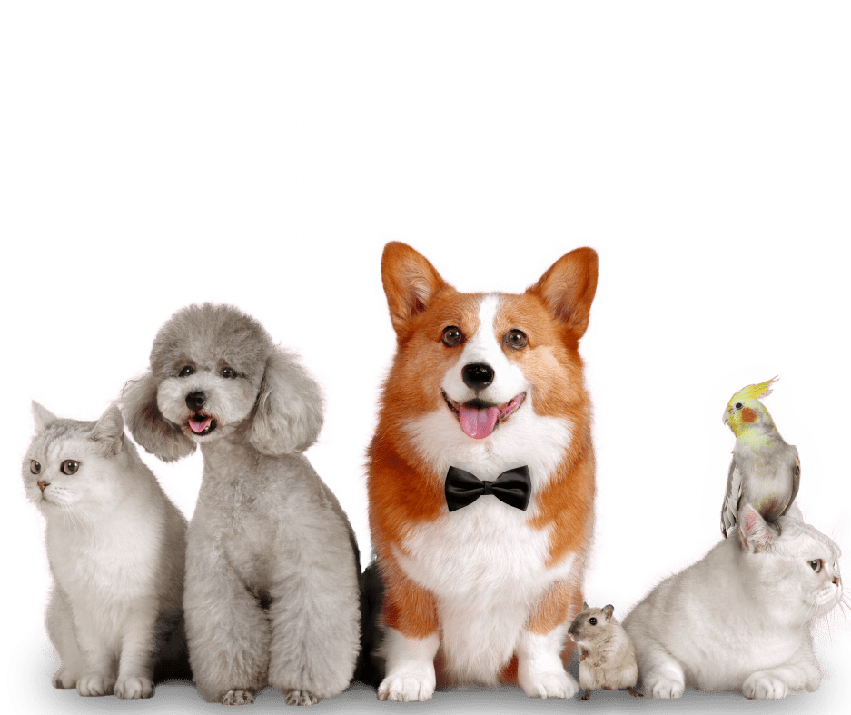
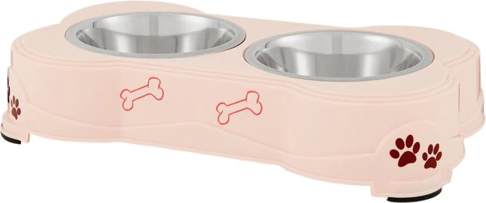
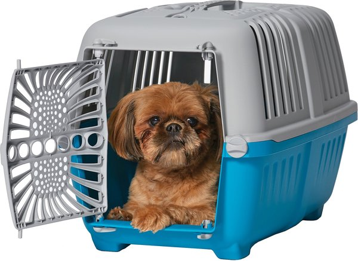
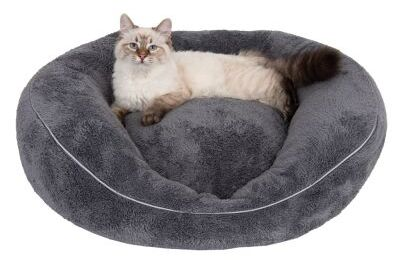
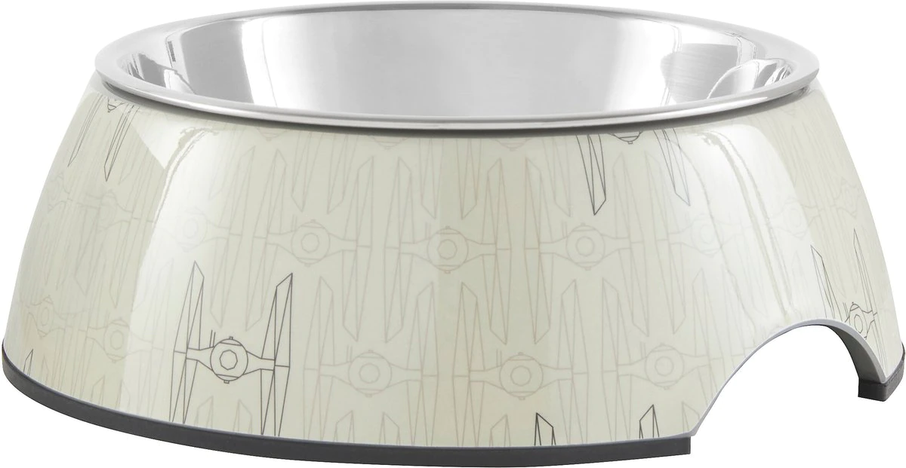
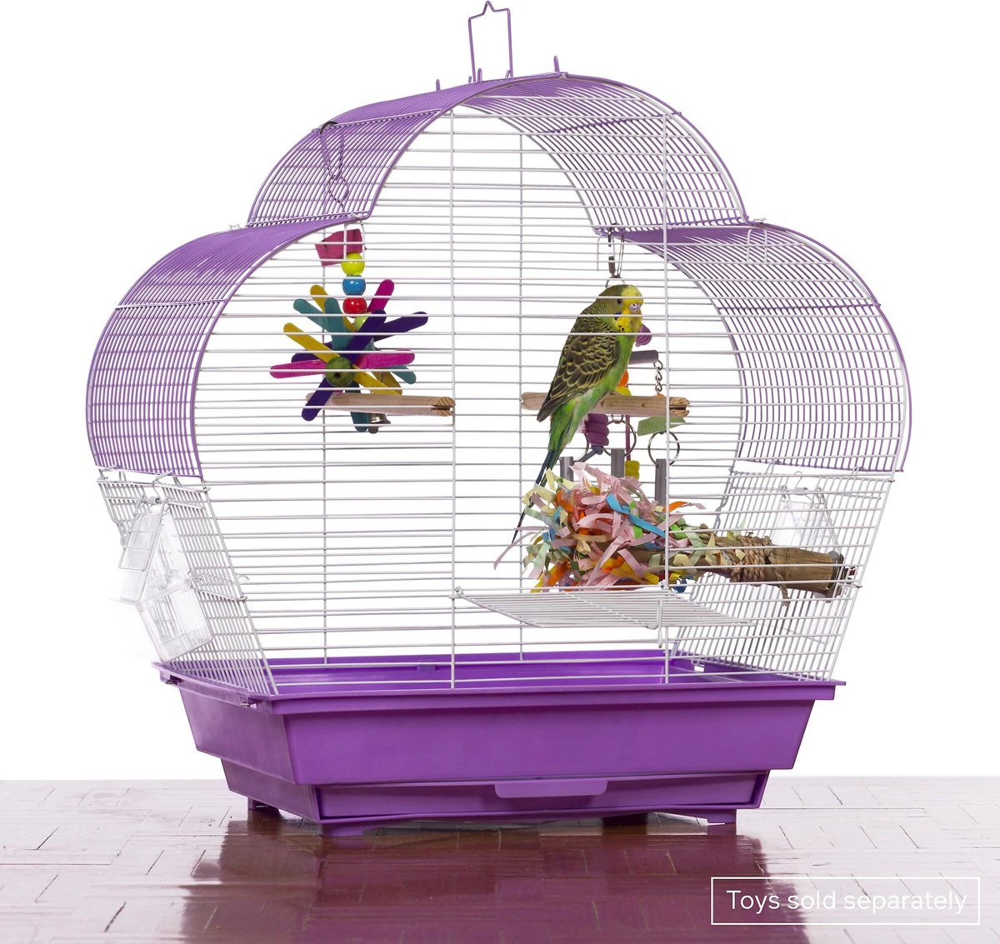

### Hi there 👋

<!--
**PetWorld-HPU2/PetWorld-HPU2** is a ✨ _special_ ✨ repository because its `README.md` (this file) appears on your GitHub profile.

Here are some ideas to get you started:

- 🔭 I’m currently working on ...
- 🌱 I’m currently learning ...
- 👯 I’m looking to collaborate on ...
- 🤔 I’m looking for help with ...
- 💬 Ask me about ...
- 📫 How to reach me: ...
- 😄 Pronouns: ...
- ⚡ Fun fact: ...
-->
<!DOCTYPE html>
<html lang="en">
<head>
    <meta charset="UTF-8">
    <meta http-equiv="X-UA-Compatible" content="IE=edge">
    <meta name="viewport" content="width=device-width, initial-scale=1.0">
    <title>Pet World</title>
    <link rel="stylesheet" href="css/style.css">
    <link rel="stylesheet" href="css/normalize.css">
    <!-- Font Awesome  -->
    <link rel="stylesheet" href="css/all.min.css">
     <!-- google fonts  -->
    <link rel="preconnect" href="https://fonts.googleapis.com">
    <link rel="preconnect" href="https://fonts.gstatic.com" crossorigin>
    <link href="https://fonts.googleapis.com/css2?family=Montserrat:wght@400;500;600;700&display=swap" rel="stylesheet">

    <!-- headroom  -->
    

    <!-- Animate Css -->
    <link rel="stylesheet" href="https://cdnjs.cloudflare.com/ajax/libs/animate.css/4.1.1/animate.min.css"/>

  <!-- Link Swiper's CSS -->
    <link
      rel="stylesheet"
      href="https://cdn.jsdelivr.net/npm/swiper/swiper-bundle.min.css"
    />
</head>
<body>

  <!-- Start Main page  -->
    

    <!-- start header  -->
    <header class="headroom" id="header">
        

        

            
<i class="fa-solid fa-paw"></i>

            
Pet  World
            
        

        <ul class="menu">
            <li><a href="#home" data-after= "Home">Trang chủ</a></li>
            <li><a href="#services" data-after= "Services">Dịch vụ</a></li>
            <li><a href="#products" data-after= "Products">Sản Phẩm</a></li>
            <li><a href="#discount" data-after= "Discount">Khuyến mãi</a></li>
        </ul>
        

        

            <i class="fa-solid fa-cart-shopping"></i>
            <i class="fa-solid fa-user" id="user"></i>
        

        

          

        

        
 
            <h2>Đăng nhập</h2>
            <input type="email" name="" placeholder="Điền tên đăng nhập">
            <input type="password" name="" placeholder="Điền mật khẩu">
            

            <input type="checkbox" name="remember" id="remember">
            <label for="remember">Nhớ mật khẩu<label>
                

            

                <a href="">Đăng nhập</a>
            

            

                <a href="">Quên mật khẩu ?</a>
                <a href="">Đăng kí</a>
            

        

        

        
    </header>
    <!-- end header -->

    <!-- start landing  -->
    

        

        

            <h1>Sự hài lòng
là ưu tiên
của chúng tôi</h1>
            
làm cho thú cưng luôn thoải mái, hài lòng, vui vẻ bằng cách cung cấp những cơ sở vật chất và thức ăn tốt nhất

            

                <a href="#products">Vào Shop <svg class="button__svg" role="presentational" viewBox="0 0 600 600">
    <defs>
      <clipPath id="myClip">
        <rect x="0" y="0" width="100%" height="50%" />
      </clipPath>
    </defs>
    <g clip-path="url(#myClip)">
      <g id="money">
        <path d="M441.9,116.54h-162c-4.66,0-8.49,4.34-8.62,9.83l.85,278.17,178.37,2V126.37C450.38,120.89,446.56,116.52,441.9,116.54Z" fill="#699e64" stroke="#323c44" stroke-miterlimit="10" stroke-width="14" />
        <path d="M424.73,165.49c-10-2.53-17.38-12-17.68-24H316.44c-.09,11.58-7,21.53-16.62,23.94-3.24.92-5.54,4.29-5.62,8.21V376.54H430.1V173.71C430.15,169.83,427.93,166.43,424.73,165.49Z" fill="#699e64" stroke="#323c44" stroke-miterlimit="10" stroke-width="14" />
      </g>
      <g id="creditcard">
        <path d="M372.12,181.59H210.9c-4.64,0-8.45,4.34-8.58,9.83l.85,278.17,177.49,2V191.42C380.55,185.94,376.75,181.57,372.12,181.59Z" fill="#a76fe2" stroke="#323c44" stroke-miterlimit="10" stroke-width="14" />
        <path d="M347.55,261.85H332.22c-3.73,0-6.76-3.58-6.76-8v-35.2c0-4.42,3-8,6.76-8h15.33c3.73,0,6.76,3.58,6.76,8v35.2C354.31,258.27,351.28,261.85,347.55,261.85Z" fill="#ffdc67" />
        <path d="M249.73,183.76h28.85v274.8H249.73Z" fill="#323c44" />
      </g>
    </g>
    <g id="wallet">
      <path d="M478,288.23h-337A28.93,28.93,0,0,0,112,317.14V546.2a29,29,0,0,0,28.94,28.95H478a29,29,0,0,0,28.95-28.94h0v-229A29,29,0,0,0,478,288.23Z" fill="#a4bdc1" stroke="#323c44" stroke-miterlimit="10" stroke-width="14" />
      <path d="M512.83,382.71H416.71a28.93,28.93,0,0,0-28.95,28.94h0V467.8a29,29,0,0,0,28.95,28.95h96.12a19.31,19.31,0,0,0,19.3-19.3V402a19.3,19.3,0,0,0-19.3-19.3Z" fill="#a4bdc1" stroke="#323c44" stroke-miterlimit="10" stroke-width="14" />
      <path d="M451.46,435.79v7.88a14.48,14.48,0,1,1-29,0v-7.9a14.48,14.48,0,0,1,29,0Z" fill="#a4bdc1" stroke="#323c44" stroke-miterlimit="10" stroke-width="14" />
      <path d="M147.87,541.93V320.84c-.05-13.2,8.25-21.51,21.62-24.27a42.71,42.71,0,0,1,7.14-1.32l-29.36-.63a67.77,67.77,0,0,0-9.13.45c-13.37,2.75-20.32,12.57-20.27,25.77l.38,221.24c-1.57,15.44,8.15,27.08,25.34,26.1l33-.19c-15.9,0-28.78-10.58-28.76-25.93Z" fill="#7b8f91" />
      <path d="M148.16,343.22a6,6,0,0,0-6,6v92a6,6,0,0,0,12,0v-92A6,6,0,0,0,148.16,343.22Z" fill="#323c44" />
    </g>

                </svg></a>
                
                
                   
            

        

        

        
        

    

    

    <!-- end landing -->

    

  <!-- End Main page  -->

       <!-- Start Services  -->
     <section class="services padding" id="services">
      
 
        

        <h1>Dịch vụ Pet</h1>
      

      

        

          

            
            <h2>Gửi Pet </h2>
          

          

            
Mở

            

            <a href="#">Hiện thêm</a>
          

        

        

          

             
            <h2>Tắm cho Pet </h2>
          

          

            
Mở

            

            <a href="#">Hiện thêm</a>
          

        

        

          

            
            <h2>Thú y</h2>
          

          

            
Mở

            

            <a href="#">Hiện thêm</a>
          

        

        

          

            
            <h2>Thức ăn tốt cho Pet</h2>
          

          

            
Mở

            

            <a href="#">Hiện thêm</a>
          

        

        

          

            
            <h2>Hoạt động vui chơi Pet</h2>
          

          

            
Mở

            

            <a href="#">Hiện thêm</a>
          

        

        

          

            
            <h2>Chải chuốt Pet</h2>
          

          

            
Mở

            

            <a href="#">Hiện thêm</a>
          

        

      

      

    </section>
    <!-- end Services  -->

    <!-- Start products  -->
    <section class="products padding" id="products">
      

        

          <h1>Sản phẩm cho Pet</h1>
        

        

          <h3>Bán chạy</h3> 
          

            <h4>Xem thêm </h4>
            <i class="fa-solid fa-arrow-right"></i>
          

          

            

              

                

                  
                

                

                  

                    <h3>Đĩa đựng thức ăn</h3>
                    
                  

                  
2 ngăn thức ăn cho Thú cưng , Hồng 

                  

                    <i class="fa-solid fa-star" style="color: rgb(255, 187, 0);"></i>
                    <i class="fa-solid fa-star" style="color: rgb(255, 187, 0);"></i>
                    <i class="fa-solid fa-star" style="color: rgb(255, 187, 0);"></i>
                    <i class="fa-solid fa-star" style="color: rgb(255, 187, 0);"></i>
                    <i class="fa-regular fa-star" style="color: rgb(255, 187, 0);"></i>
                    4.5
                  

                  

                    <h4>250.000đ</h4>
                    
Thêm vào giỏ

                  

                

              

              

                

                  
                

                

                  

                    <h3>Lồng Pet</h3>
                    
                  

                  
Mang Pet đi muôn nơi

                  

                    <i class="fa-solid fa-star" style="color: rgb(255, 187, 0);"></i>
                    <i class="fa-solid fa-star" style="color: rgb(255, 187, 0);"></i>
                    <i class="fa-solid fa-star" style="color: rgb(255, 187, 0);"></i>
                    <i class="fa-solid fa-star" style="color: rgb(255, 187, 0);"></i>
                    <i class="fa-regular fa-star" style="color: rgb(255, 187, 0);"></i>
                    4.5
                  

                  

                    <h4>250.000đ</h4>
                    
Thêm vào giỏ

                  

                

              

              

                

                  
                

                

                  

                    <h3>Nệm ngủ Pet </h3>
                    
                  

                  
Hoàn hảo cho một chú chó con hoặc một chú mèo

                  

                    <i class="fa-solid fa-star" style="color: rgb(255, 187, 0);"></i>
                    <i class="fa-solid fa-star" style="color: rgb(255, 187, 0);"></i>
                    <i class="fa-solid fa-star" style="color: rgb(255, 187, 0);"></i>
                    <i class="fa-solid fa-star" style="color: rgb(255, 187, 0);"></i>
                    <i class="fa-regular fa-star" style="color: rgb(255, 187, 0);"></i>
                    4.5
                  

                  

                    <h4>250.000đ</h4>
                    
Thêm vào giỏ 

                  

                

              

              
              

                

                  
                

                

                  

                    <h3> Bát đựng thức ăn </h3>
                    
                  

                  
Bát inox chống trơn cho Pet 

                  

                    <i class="fa-solid fa-star" style="color: rgb(255, 187, 0);"></i>
                    <i class="fa-solid fa-star" style="color: rgb(255, 187, 0);"></i>
                    <i class="fa-solid fa-star" style="color: rgb(255, 187, 0);"></i>
                    <i class="fa-solid fa-star" style="color: rgb(255, 187, 0);"></i>
                    <i class="fa-regular fa-star" style="color: rgb(255, 187, 0);"></i>
                    4.5
                  

                  

                    <h4>250.000đ</h4>
                    
Thêm vào giỏ

                  

                

              

              

                

                  
                

                

                  

                    <h3>Vụn bánh</h3>
                    
                  

                  
Thức ăn cho chim

                  

                    <i class="fa-solid fa-star" style="color: rgb(255, 187, 0);"></i>
                    <i class="fa-solid fa-star" style="color: rgb(255, 187, 0);"></i>
                    <i class="fa-solid fa-star" style="color: rgb(255, 187, 0);"></i>
                    <i class="fa-solid fa-star" style="color: rgb(255, 187, 0);"></i>
                    <i class="fa-regular fa-star" style="color: rgb(255, 187, 0);"></i>
                    4
                  

                  

                    <h4>100.000đ</h4>
                    
Thêm vào giỏ

                  

                

              

              

                

                  
                

                

                  

                    <h3>Lồng Chim</h3>
                    
                  

                  
Vừa có thể nuôi Pet vừa có thể trang trí.

                  

                    <i class="fa-solid fa-star" style="color: rgb(255, 187, 0);"></i>
                    <i class="fa-solid fa-star" style="color: rgb(255, 187, 0);"></i>
                    <i class="fa-solid fa-star" style="color: rgb(255, 187, 0);"></i>
                    <i class="fa-solid fa-star" style="color: rgb(255, 187, 0);"></i>
                    <i class="fa-regular fa-star" style="color: rgb(255, 187, 0);"></i>
                    5.5
                  

                  

                    <h4>150.000đ</h4>
                    
Thêm vào giỏ 

                  

                

              

              
            

          

          

          
  

          

        

        

        
          

          

          
  

          

        

      

    </section>
    <!-- End Products -->

    <!-- start pricing  -->
    <section class="pricing padding" id="pricing">
     

        

        <h1>Gói chăm sóc của Pet World</h1>
        

        

          

            <h2>Cơ Bản</h2>
            <h1>100.000đ</h1>
            
1 Ngày

            <ul>
              <li>Đi dạo</li>
              <li>Chải chuốt</li>
              <li>Ăn uống phù hợp</li>
              <li>Hoạt động vui chơi </li>
            </ul>
            <a href="#">Lựa chọn</a>
          

          

            <h2>Standard</h2>
            <h1>500.000đ</h1>
            
1 Tuần

            <ul>
              <li>Nhà ở riêng</li>
              <li>Chải chuốt</li>
              <li>Ăn uống phù hợp</li>
              <li>Hoạt động vui chơi và đi dạo </li>
              <li>Kiểm tra thú y </li>
              <li>Theo dõi thú cưng qua website </li>
            </ul>
            <a href="#">Lựa chọn </a>
          

          

            <h2>Premium</h2>
            <h1>1.500.000đ</h1>
            
1 Month

            <ul>
              <li>Nhà ở riêng</li>
              <li>Tắm và Chải chuốt</li>
              <li>Ăn uống phù hợp</li>
              <li>Tỉa lông</li>
              <li>Hoạt động vui chơi và đi dạo </li>
              <li>Kiểm tra thú y </li>
              <li>Theo dõi thú cưng qua website </li>

            </ul>
            <a href="#">Lựa chọn</a>
          

        

     

    </section>

    <!-- end pricing  -->

    <!-- start stats  -->
    <section class="statists" id="statists">
      

        <h1>Cam theo dõi thú cưng</h1>
      

      

        

        

          <video width="100%" height="750px" muted autoplay loop>
            <source src="pet.mp4">
        </video>
        

      

      
      
    </section>
    <!-- end stats -->

    <!-- start sitters  -->
    
    <!-- end sitters  -->

    <!-- Start Tests -->
    
    <!-- end tests  -->

    <!-- start events -->
    
    <!-- end events  -->

    <!-- start discount  -->
    <section class="discount padding" id="discount">
      

        <h1>Super Sale</h1>
      

      

        

          

            
          

          

            

            <h1>Nhận mã giảm giá </h1>
            <form action="">
              <input type="text" placeholder="Tên">
              <input type="email" placeholder="Email">
              <input type="tel" placeholder="Số điện thoại">
              <input type="submit" value="Gửi ">
            </form>
            

          

        

        

    </section>
    <!-- end discount -->

    <!-- start Footer  -->
    <section class="footer" id="footer">
      

      

        

            
<i class="fa-solid fa-paw"></i>

            
Pet World
            
        

        
Với Pet World, dù ở đâu bạn cũng có thể theo dõi được thú cưng của mình.

      

      

          <h1>Thành Viên</h1>
          <ul>
            <li> <a href="https://www.facebook.com/profile.php?id=100068440123854">TxT</a> </li>
            <li> <a href="https://www.facebook.com/lethithunguyet02">Nguyệt</a> </li>
            <li> <a href="https://www.facebook.com/profile.php?id=100016363387186">Nhung</a> </li>
          </ul>
        

  
        

          <h1>Liên hệ </h1>
          

            <i class="fas fa-map-marker-alt fa-fw"></i>
          
Không có địa điểm
          
  
          

          

            <i class="fas fa-phone-volume fa-fw"></i>
            
0919.999.999

          

          

            <i class="fa-solid fa-envelope"></i>
            
PetWorld@gmail.com

          

        

        
        

        

          <ul class="wrapper">
          <li class="icon facebook"><a href="https://www.facebook.com/">
      Facebook
      <i class="fab fa-facebook-f"></i></a>
    </li>
    <li class="icon twitter"><a href="https://twitter.com/">
      Twitter
      <i class="fab fa-twitter"></i></a>
    </li>
    <li class="icon instagram"><a href="https://www.instagram.com/">
      Instagram
      <i class="fab fa-instagram"></i></a>
    </li>
    <li class="icon github">
      Github
      <i class="fab fa-github"></i>
    </li>
    <li class="icon youtube"><a href="https://www.youtube.com/">
      Youtube
      <i class="fab fa-youtube"></i></a>
    </li>
          </ul>
          
Trường Đại học Sư Phạm Hà Nội 2 - HPU2 

        

    </section>
    <!-- end Footer  -->
    <!-- Js File  -->
    
    <!-- Swiper JS -->
    
    <!-- Initialize Swiper -->
    
</body>
</html>
